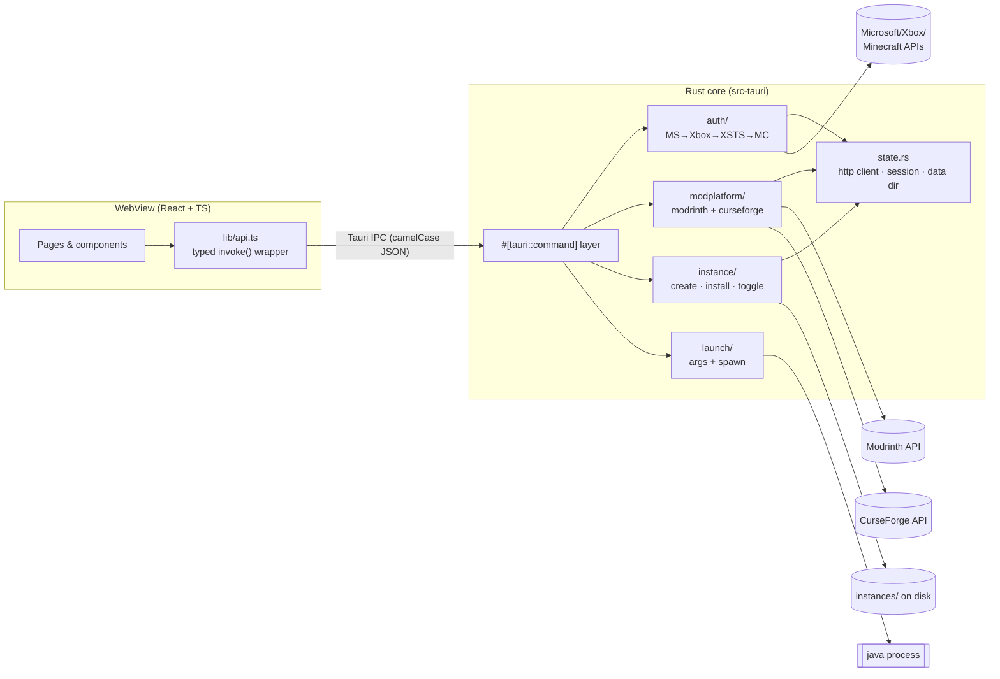

# Void Launcher — Concept & Architecture

A custom Minecraft launcher with Microsoft authentication, CurseForge/Modrinth mod integration, a custom modpack builder and per-instance management — in a modern dark-purple UI.

---

## 1. Tech stack decision

**Chosen: Tauri 2 (Rust backend) + React + TypeScript + Tailwind CSS 4**

| Criterion | **Tauri 2 + React** ✅ | Electron + React | C# / .NET (WPF/Avalonia) |
| --- | --- | --- | --- |
| Bundle size | ~8–15 MB | ~150 MB+ | ~60 MB+ (self-contained) |
| RAM footprint | Low (system WebView) | High (bundled Chromium) | Medium |
| Backend language | **Rust** — ideal for parallel downloads, SHA-1 verification, zip/natives handling, process spawning | Node.js — works, weaker at CPU-bound verification | C# — good |
| API/auth ecosystem | `reqwest`, `oauth2`, `minecraft-msa-auth`, `lyceris` | `prismarine-auth`, `msmc`, `minecraft-launcher-core` | `CmlLib.Core` (very complete) |
| Security model | Explicit IPC command allowlist; WebView has **no** fs/net access | Full Node in renderer unless carefully isolated | n/a |
| Modern "dark purple" UI | Trivial (web stack) | Trivial (web stack) | Harder (XAML theming) |

Why it matters **for a launcher specifically**: the launcher stays open while Minecraft runs — every MB of RAM the launcher doesn't use is a MB for the game. Tauri's Rust core also makes the heavy parts (hundreds of parallel asset downloads with hash checks) fast and safe. Electron is the fallback if you ever need Chromium-exact rendering; `CmlLib.Core` makes C# attractive if you'd rather trade UI flexibility for a batteries-included launch pipeline.

### Frontend libraries

| Library | Purpose |
| --- | --- |
| **Tailwind CSS v4** | Design tokens as CSS (`@theme`) — the whole dark-purple system lives in one file |
| **zustand** | Tiny global state (active view, account) |
| **TanStack Query** | Caching/retries/loading states for all API-backed data |
| **lucide-react** | Consistent icon set |
| Optional: **shadcn/ui** (Radix) | Accessible dialogs/dropdowns/tooltips you restyle with the same tokens |
| Optional: **framer-motion** | Page transitions, hover micro-animations |

---

## 2. Architecture



Principles:

- **The WebView is untrusted UI.** All network and filesystem work happens in Rust behind an explicit command allowlist. The Minecraft access token never enters the WebView.
- **One unified mod model.** `modrinth.rs` and `curseforge.rs` both return `ModSummary` / `ModVersionInfo`; nothing above them knows platform quirks.
- **Instances are plain folders** with a pretty-printed `instance.json` — debuggable, portable, trivially backed up.

### Data layout on disk

```
<app-data>/dev.void.launcher/
├── settings.json               # global: curseforgeApiKey, defaultJavaPath
├── instances/<uuid>/
│   ├── instance.json           # name, versions, loader, memoryMb, mods[]
│   ├── mods/*.jar              # active mods
│   └── mods/*.jar.disabled     # deactivated mods (rename trick)
└── meta/                       # (M3) shared caches: libraries/, assets/, java/
```

---

## 3. Feature specs

### 3.1 Microsoft authentication — *scaffolded ✅*
Device-code OAuth flow (no embedded browser, no redirect server), then the Xbox Live → XSTS → `login_with_xbox` → profile chain. Details + Azure setup: [AUTHENTICATION.md](AUTHENTICATION.md). Production hardening: persist the MSA refresh token in the OS keychain (`keyring` crate) and refresh silently.

### 3.2 Mod search & install — *scaffolded ✅*
Search either platform with query + game version + loader filters; install resolves "newest compatible version", downloads, SHA-1-verifies and records the jar. Platform quirks (facets, loader enums, CF download opt-out): [MOD_APIS.md](MOD_APIS.md).

### 3.3 Custom modpack builder — *scaffolded ✅*
An instance = Minecraft version + loader + mod set + settings. Create in the UI, add mods with one click from the browser, toggle via `.jar.disabled` rename (works with every loader). Export/import (`.mrpack`, CF zip) is a natural M5 extension.

### 3.4 Instance management & launch — *args scaffolded, pipeline M3 🚧*
Per-instance RAM/Java/JVM-flags already editable and persisted. `launch/` builds the full JVM + game argument lists and spawns Java; what's missing is the download pipeline (manifest → client jar → libraries → assets → natives → loader profile). Options: implement natively (docs in `launch/mod.rs`) or adopt the `lyceris` crate which ships the whole pipeline incl. Fabric/Forge/NeoForge/Quilt.

### 3.5 Dockable sidebar — *scaffolded ✅*
The nav rail drags (or toggles) between the left and right screen edge with a FLIP-animated snap; docked side is persisted. Details: [ADVANCED_FEATURES.md §1](ADVANCED_FEATURES.md).

### 3.6 Performance optimizer & Java auto-management — *scaffolded ✅*
Hardware scan (sysinfo + per-OS GPU queries), Light/Balanced/Strong tiers for heap + JVM flags, Windows GPU preference, and fully automatic Temurin JRE installs isolated under `<data>/java/<major>/` — every change reported in a transparent log. Details: [ADVANCED_FEATURES.md §2–3](ADVANCED_FEATURES.md).

### 3.7 Distribution: Bootstrapper, client, website, deep links — *scaffolded ✅*
The one-time Bootstrapper and daily-use Client are separate Tauri applications. The Bootstrapper verifies the exact release asset and checksum, creates shortcuts, registers `voidlauncher://` and starts the client; the client bundle contains no installer stages. Details: [DISTRIBUTION.md](DISTRIBUTION.md).

---

## 4. Design system — "Dark Purple"

Defined once in [`src/styles/theme.css`](../src/styles/theme.css) via Tailwind v4 `@theme` tokens:

| Token group | Values | Used for |
| --- | --- | --- |
| `void-950 … void-600` | `#0b0b12 → #34344a` | app bg → panels → cards → borders/inputs |
| `accent-300 … accent-800` | violet ramp around `#8b5cf6` | buttons, active nav, links, glows |
| `accent-glow` | `rgb(139 92 246 / .35)` | box-shadow glow on primary actions |
| `ink-100/300/500` | `#f2f2f8 / #b6b6c8 / #767688` | text hierarchy |

Rules of thumb: backgrounds are near-black with a violet undertone (never pure `#000`); **one** glowing accent per view region (the primary action); hovers move *toward* purple (border/text tint) rather than lightening gray; generous 8-pt spacing and `rounded-lg/xl` for the "clean" feel.

---

## 5. Roadmap

| Milestone | Scope | Status |
| --- | --- | --- |
| **M0** | Scaffold: UI shell, theme, IPC layer, docs | ✅ this commit |
| **M1** | Auth polish: Azure app approval, keychain persistence, silent refresh, account switcher | 🚧 |
| **M2** | Mod browser polish: pagination, version picker dialog, installed-mods panel with toggles | 🚧 |
| **M3** | **Launch pipeline**: piston-meta manifest, parallel downloads + SHA-1, natives, Fabric profile, Mojang JRE; then NeoForge/Forge | 🚧 |
| **M4** | Settings UI (global + per-instance), log viewer, crash reporting | 🚧 |
| **M5** | Modpack import/export (`.mrpack`, CurseForge zip), instance duplication, auto-updates (`tauri-plugin-updater`) | 🚧 |
